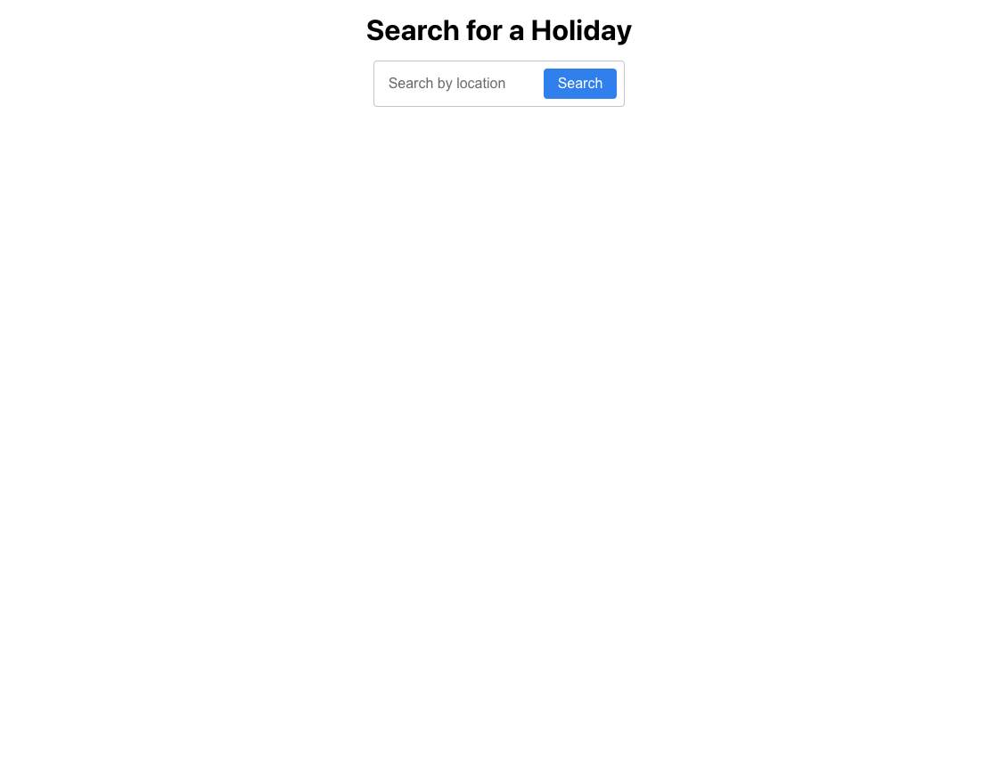
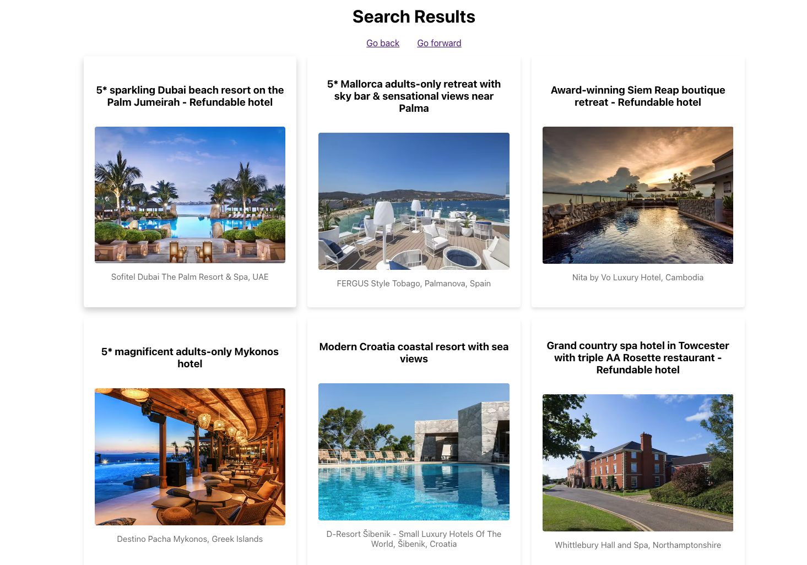
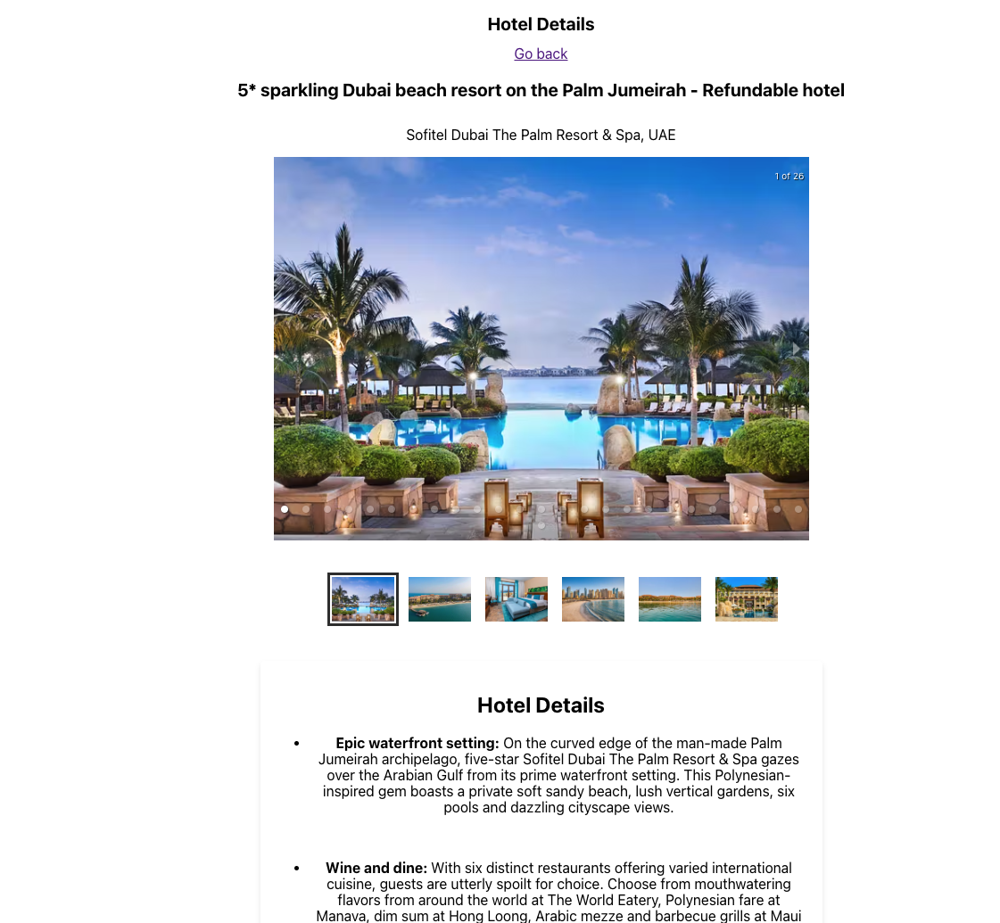

# Secret Escapes Hotel Search!

## Seach result page

&nbsp;
&nbsp;

&nbsp;
&nbsp;

## Sale details page

&nbsp;
&nbsp;

## How to start this ptoject!

# Note This project was created using node version **v17.4.0**

## clone the branch

```
git clone https://github.com/Milan-960/Holiday-search.git
```

## Install dependecies

```
npm install
```

## run on the localhost

```
npm start
```

## Assignment Criteria

● Users should be able to search by free text

● Search results should show the total number of results

● Search results should only include the first 10 sales in the list

● Each search result should link to the sale detail page

● Browser navigation should work (e.g. going from search results to sale details and
clicking the back button should take you back to search results)

## All of the functionality has been added!

| Details        | Route                       | Description                                                                                                                                                                 |
| -------------- | --------------------------- | --------------------------------------------------------------------------------------------------------------------------------------------------------------------------- |
| Homepage       | /                           | Simply contains a search box for a user's location query.                                                                                                                   |
| Search results | /search?query=<search term> | A list of results that match the search performed, and link through to the details page. The list should show: <br>✅ Title<br>✅ Destination<br>✅ Lead photo              |
| Sale details   | /sale/<ID>                  | A page with more rich information about the hotel/sale in question. The page should include:<br>✅ Title<br>✅ Destination<br>✅ Lead photo<br>✅ Hotel details<br>✅ Price |

### Tecnologias which have been used 🔥

- [ReactJS](https://react.dev/)
- [React-Router](https://reactrouter.com/en/6.10.0)
- [Graphql](https://graphql.org/)
- [HTML React Parser](https://www.npmjs.com/package/html-react-parser)

## Here are the links to the branches!

[Master](https://github.com/Milan-960/Holiday-search)

[Develop](https://github.com/Milan-960/Holiday-search/tree/develop)
